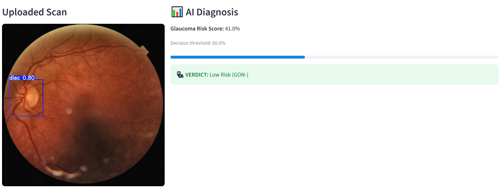

# TopoMedic AI: Mitigating Shortcut Learning in Glaucoma Detection (IDSC 2026 Submission)

**TopoMedic AI** is an interpretable diagnostic framework for Glaucomatous Optic Neuropathy (GON). It abandons the architectural bloat and "black-box" opacity of standard Deep Learning by pairing **Topological Data Analysis (TDA)** with an interpretable shallow classifier.

### The "Saliency Illusion"
In our adversarial audits, a transfer-learned ResNet-18 achieved a **0.99 AUROC** on the Hillel Yaffe Glaucoma Dataset (HYGD). However, targeted spatial ablation revealed this to be a fraud: the CNN maintained 96% accuracy even when the biological optic disc was completely masked. It was exploiting non-biological camera artifacts (Shortcut Learning). 

TopoMedic AI solves this. By anchoring predictions strictly to the mathematical invariants of retinal geometry, we built a model that is clinically safe, mathematically rigorous, and deployable on low-power edge hardware.

  

---

## ⚙️ Topological Architecture

Rather than guessing which pixels matter, TopoMedic AI uses the physics of light and topology to force deterministic biomarker extraction.

1. **Automated ROI Localization:** A custom-tuned YOLO26 isolates the optic disc region, immediately stripping peripheral dataset noise.
2. **Orthogonal Landscape Engineering:** We extract three mathematically independent biological planes:
   - *Vascular:* Frangi vesselness filter (Green channel) for kinking/tortuosity.
   - *Disc Morphology:* High-sigma Gaussian blur (Red channel) for cup-to-disc boundary.
   - *Peripapillary Texture (PPA):* Shannon Entropy (grayscale) mapping spatial tissue degradation.
3. **Topological Data Analysis (Cubical Homology):** Using `giotto-tda`, we extract the birth/death of structural features across the landscapes. Aggressive downsampling to 5x5 **Persistence Images** acts as a topological low-pass filter, destroying micro-level visual noise while preserving macro-pathology.
4. **Interpretable Inference:** A Random Forest classifier processes these tabular topological vectors alongside scalar metadata (Image Quality Scores). 

---

## 📊 Performance Metrics

| Metric / Benchmark | CNN Baseline (ResNet-18) | **TopoMedic AI (TDA+RF)** | Clinical Significance |
| :--- | :--- | :--- | :--- |
| **AUROC** | 0.993 ± 0.006 | **0.858 ± 0.025** | General Class Separability |
| **Recall (Sensitivity)**| 0.981 ± 0.015 | **0.95 ± 0.026** | **Patient Safety:** Avoids catastrophic False Negatives |
| **Ablation Resilience**| **FAILED** (Relies on noise) | **PASSED** (Pathology-bound) | Proves model logic is biologically valid |
| **Logic Mechanism** | Saliency only (Grad-CAM) | **Additive (SHAP)** | Generates "Itemised Clinical Receipts" |
| **Compute Profile** | Infrastructure Dependent | **Edge-Ready** | Cloud-independent privacy; runs on edge device |

---

## 🖥️ Streamlit Deployment (app.py)

TopoMedic AI is more than a script, it is a clinical tool. We built a Streamlit interface that provides **Itemised Transparency**. It outputs not just a probability score, but a game-theoretic **SHAP Waterfall Plot** binned by biological landscape (Vascular, Disc, Texture). This gives the clinician the exact biological rationale they need to authorize treatment.

  

### To Run App
pip install uv

uv sync

uv run streamlit run app.py

---

## Documentations
Go through our workflow in the following **Jupyter notebooks**:

1.0 CNN_training_notebook.ipynb

1.5 CNN_cross_val_notebook.ipynb

2.0 YOLO26_cropping_script.ipynb

3.0 TDA_training_notebook.ipynb

3.5 TDA_cross_val_notebook.ipynb

4.0 YOLO26_training_notebook.ipynb
